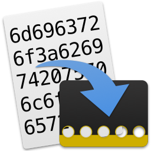
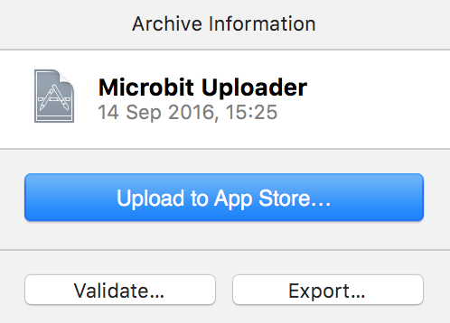

# @boardname@ uploader for OS X

This project is a clone of the [Windows
uploader](https://pxt.microbit.org/uploader), but for OS X. Once launched,
the app runs in your menu bar and will automatically deploy any HEX files to
your `@boardname@`. Like the Windows version, it is compatible with any browser
that can run [pxt.microbit.org](http://pxt.microbit.org).

## Install the built version

1. Download the latest `.zip` release from the `Release` directory
2. Unzip it
3. Drag `Microbit Uploader` to your Applications folder and launch it

## Building

To build the project you'll need a copy of OS X 10.11 or higher and Xcode 8 or
higher (you may be able to build on earlier OSes or versions of Xcode, but this
remains untested). Once you have a development environment set up, just build
and run `Microbit Uploader.xcodeproj`.

## Distributing

1. Open the Xcode project
2. Product > Archive
3. Export:

    

4. You will then have the option of either signing or not-signing the
   application:

    a) If you have an Apple developer account, select 'Export a Developer
       ID-signed Application'

    b) If you don't have a developer ID, select 'Export as a macOS App'

5. Zip the produced app and upload to CDN or equivalent
